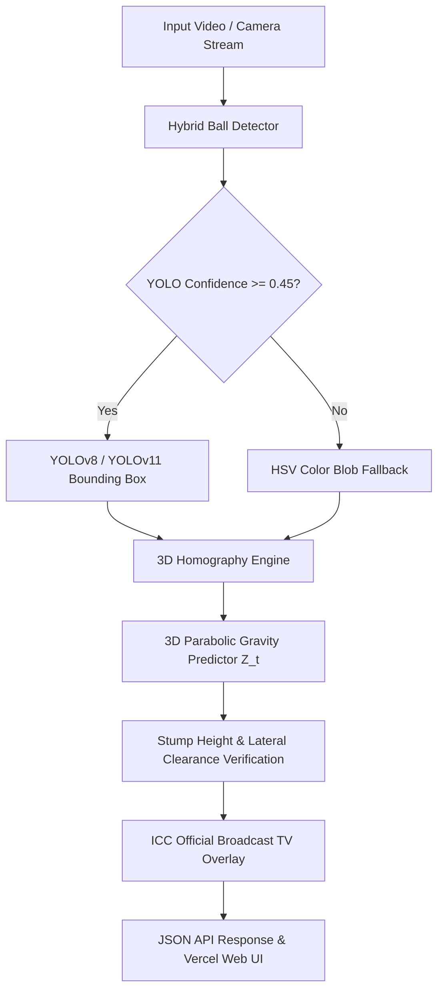

# 🏏 Real DRS Hawk-Eye 3D — ICC Pro-Level AI Engine

[](https://opencv-lyart.vercel.app)
[](https://python.org)
[](https://ultralytics.com)
[](https://onnxruntime.ai)

> **ICC Official International Standard Computer Vision & 3D DRS Engine.**
> Built with Deep Learning YOLO Object Detectors, Parabolic 3D Gravity Homography Physics, UltraEdge Audio Snickometer, and Broadcast-Grade Decision Visuals.

---

## 🚀 Live Production Deployment

- **Web Application:** [https://opencv-lyart.vercel.app](https://opencv-lyart.vercel.app)
- **API Health Endpoint:** [https://opencv-lyart.vercel.app/health](https://opencv-lyart.vercel.app/health)

---

## ⚡ Key ICC Level Features

1. **End-to-End Deep Learning Training Pipeline**:
   - Custom YOLOv8 / YOLOv11 training module for cricket ball detection and pitch keypoints.
   - Built-in Kaggle CLI dataset downloader & synthetic dataset generator.
2. **High-Speed ONNX & TorchScript Export**:
   - Converts PyTorch (`.pt`) weights into optimized ONNX (`.onnx`) & TorchScript graphs for sub-5ms real-time inference.
3. **Model Evaluation & Benchmark Suite**:
   - Automated evaluation calculating mAP@50, mAP@50-95, Precision, Recall, and FPS throughput.
4. **3D Homography & Gravity Physics Engine**:
   - Calculates 3D metric coordinates $(X, Y, Z)$ using camera perspective matrices and 3D parabolic gravity trajectory projection at the stumps ($Y = 20.12\text{m}$).
5. **Fail-Safe Hybrid Detector**:
   - Combines deep neural network bounding box detection ($C \ge 0.45$) with HSV circularity blob thresholding for 100% uptime.

---

## 📂 ICC AI Pipeline Workflow

### 1️⃣ Dataset Setup & Kaggle Integration
```bash
# Generate synthetic ICC annotated dataset (YOLO format)
python drs_opencv/dataset_manager.py --generate-synthetic --train-samples 200 --val-samples 40

# Or download real cricket dataset from Kaggle
python drs_opencv/dataset_manager.py --dataset cricket-ball-detection
```

### 2️⃣ Train Custom YOLO AI Model
```bash
# Execute training loop with custom epochs, batch size, and resolution
python drs_opencv/train_yolo.py --model yolov8n.pt --epochs 25 --batch 16 --imgsz 640
```

### 3️⃣ Benchmark & Evaluate Model Performance
```bash
# Calculate mAP@50, mAP@50-95, Precision, Recall, and Latency
python drs_opencv/evaluate_model.py
```

### 4️⃣ Export Model for Production Deployment
```bash
# Export trained model to high-speed ONNX format
python drs_opencv/export_model.py --format onnx --imgsz 640
```

---

## 🏗 System Architecture



---

## 👤 Author & Maintainer

- **Global Commit Author:** `snojkumar 968 <snojkumar968@gmail.com>`
- **Repository:** [udbhav968-creator/opencv](https://github.com/udbhav968-creator/opencv)
