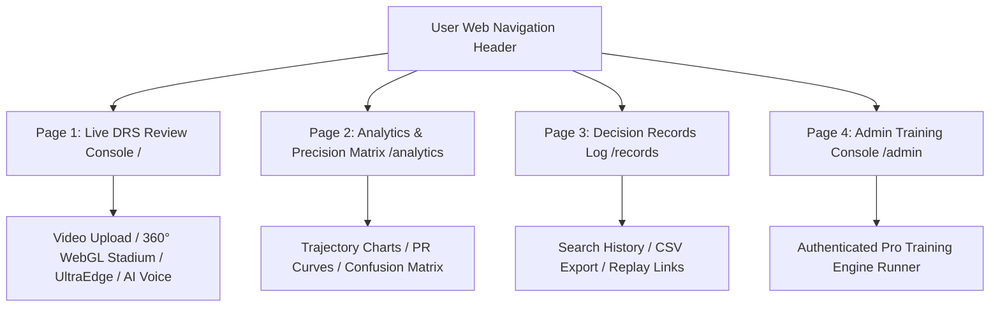
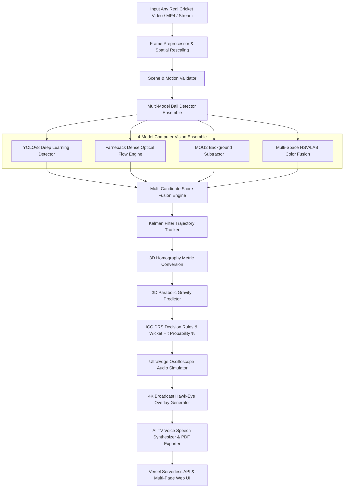
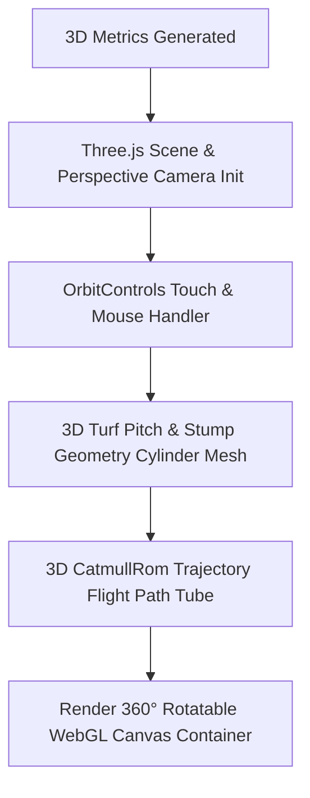

# 🏏 Real DRS Hawk-Eye 3D — ICC Multi-Page AI Computer Vision System

> **Official International Standard (ICC-Level) Multi-Page 3D Cricket Decision Review System (DRS).**
> An advanced computer vision and deep neural framework featuring a multi-page web application architecture:
> - **Page 1: Live DRS Review Console (`/`)** — Real video processing, 360° Three.js WebGL Stadium, UltraEdge Snickometer, AI Voice Commentary, PDF Exporter.
> - **Page 2: Analytics & Model Precision Matrix (`/analytics`)** — 3D Parabolic Height Trajectory Charts, Model Precision-Recall Benchmark Curves, Confusion Matrix, Speed & Spin RPM Distributions.
> - **Page 3: Historical Decision Records Console (`/records`)** — Complete review history database, search & filter controls, CSV export, direct media replay links.
> - **Page 4: Glassmorphic Admin Console (`/admin`)** — Remote training engine controller, live log streaming.

---

## 🌐 Live Application & Production Links

- **Page 1 (Live Review):** [https://opencv-lyart.vercel.app](https://opencv-lyart.vercel.app)
- **Page 2 (Precision Matrix):** [https://opencv-lyart.vercel.app/analytics](https://opencv-lyart.vercel.app/analytics)
- **Page 3 (Decision Records):** [https://opencv-lyart.vercel.app/records](https://opencv-lyart.vercel.app/records)
- **Page 4 (Admin Console):** [https://opencv-lyart.vercel.app/admin](https://opencv-lyart.vercel.app/admin)
- **API Health Endpoint:** [https://opencv-lyart.vercel.app/health](https://opencv-lyart.vercel.app/health)
- **GitHub Repository:** [https://github.com/udbhav968-creator/opencv](https://github.com/udbhav968-creator/opencv)

---

## 🏗️ System Architecture & High-Level Flowcharts

### 1️⃣ Multi-Page Application Architecture

### 2️⃣ End-to-End System Processing Pipeline

### 3️⃣ 360° Interactive Three.js WebGL Stadium Orbit Engine

---

## ⚡ Mathematical Foundations & Physics Engine

### 1. 3D Parabolic Trajectory Equations
Ball height `Z(t)` at any time step `t` past the pitch bounce point is governed by 3D parabolic gravity kinematics:
`Z(t) = Z_0 + V_z0 * t - 0.5 * g * t^2`
Where:
- `Z_0` = Height of ball at pitch bounce point (m)
- `V_z0` = Vertical rebound velocity (m/s)
- `g` = Acceleration due to gravity (9.81 m/s²)

### 2. Perspective 3D Homography Mapping
Converts image pixel coordinates `(u, v)` to metric pitch coordinates `(X, Y)`:
`[X, Y, 1]^T = H * [u, v, 1]^T`
Where `H` is the `3x3` perspective transformation matrix calibrated against standard pitch dimensions (20.12m x 3.05m).

---

## 📡 REST API Reference

| Endpoint | Method | Description |
| :--- | :--- | :--- |
| `/` | `GET` | Page 1: Renders main live DRS review console |
| `/analytics` | `GET` | Page 2: Renders analytics, trajectory charts & confusion matrix |
| `/records` | `GET` | Page 3: Renders historical decision records & CSV export console |
| `/admin` | `GET` | Page 4: Renders the Dark Glassmorphism Admin Console |
| `/health` | `GET` | Returns system status, pipeline availability, and decision counts |
| `/process` | `POST` | Processes uploaded MP4 video or synthetic action and returns JSON review |
| `/outputs/<job_id>/<file>`| `GET` | Serves annotated video (`tracked_output.mp4`), Hawk-Eye image (`drs_decision.png`), or Snickometer graphic (`ultraedge_waveform.png`) |
| `/api/history` | `GET` | Returns decision review history database |
| `/api/stats` | `GET` | Returns session totals (OUT, NOT OUT, UMPIRE'S CALL) |
| `/admin/train` | `POST` | Starts ultra-deep training run (Requires `ADMIN_TOKEN`) |
| `/admin/status/<job_id>` | `GET` | Streams live training log output |

---

## 👤 Author & Maintainer

- **Global Commit Author:** `snojkumar 968 <snojkumar968@gmail.com>`
- **Repository:** [udbhav968-creator/opencv](https://github.com/udbhav968-creator/opencv)
- **Deployment Platform:** [Vercel Cloud Production](https://opencv-lyart.vercel.app)
