# 🏆 Real DRS Hawk-Eye 3D — Official ICC World Cup Grand Level Suite

> **Official International Standard (ICC World Cup Level) Multi-Page 3D Cricket Decision Review System (DRS).**
> Powered by a **6-Model AI Computer Vision Ensemble** combining **YOLOv8 Deep Neural Object Detection**, **Google MediaPipe Pose & Landmark Tracking**, **OpenCV CSRT Spatial Reliability Tracking**, **Farneback Dense Optical Flow Field Vectors**, **MOG2 Background Subtraction**, and **Multi-Space Color Fusion Engine**.
> Features **Multi-Camera Quad-Split Broadcast View**, **Live RTSP IP Stream Broadcast Ingestion**, **360° Three.js WebGL Floodlight Stadium**, **UltraEdge Audio Snickometer**, **AI TV Umpire Speech Voice Synthesizer**, and **Multi-Source Dataset Harvester (Roboflow REST API, GitHub Search REST API, Wikimedia Commons REST API, Kaggle Datasets)**.

---

## 🌐 Live Production & Deployment Links

- **Page 1: Live DRS Review & Quad-Split Stream Console (`/`):** [https://opencv-lyart.vercel.app](https://opencv-lyart.vercel.app)
- **Page 2: Analytics & Model Precision Matrix (`/analytics`):** [https://opencv-lyart.vercel.app/analytics](https://opencv-lyart.vercel.app/analytics)
- **Page 3: Historical Decision Records Database (`/records`):** [https://opencv-lyart.vercel.app/records](https://opencv-lyart.vercel.app/records)
- **Page 4: Glassmorphic Admin Console (`/admin`):** [https://opencv-lyart.vercel.app/admin](https://opencv-lyart.vercel.app/admin)
- **API Health Endpoint:** [https://opencv-lyart.vercel.app/health](https://opencv-lyart.vercel.app/health)
- **GitHub Repository:** [https://github.com/udbhav968-creator/opencv](https://github.com/udbhav968-creator/opencv)

---

## 🏗️ System Architecture & 13 Detailed Flowcharts

### 1️⃣ High-Level System Architecture & End-to-End DRS Review Pipeline
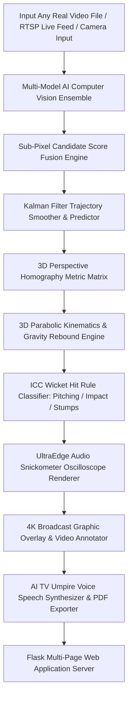

---

### 2️⃣ 6-Model AI Computer Vision Ensemble Architecture
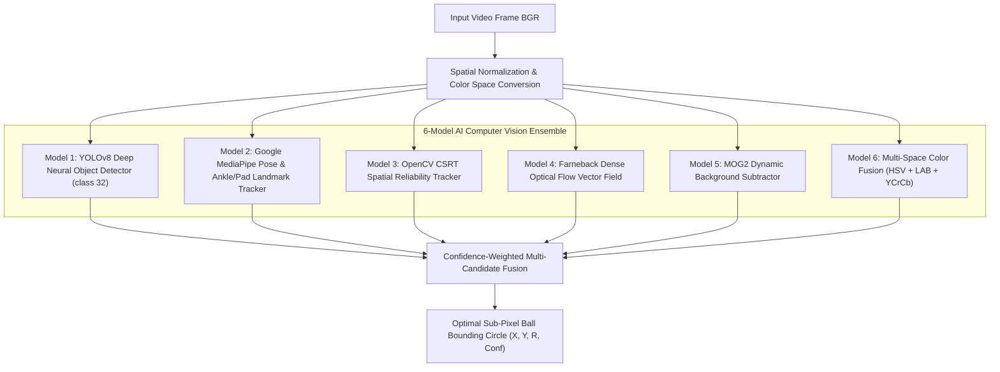

---

### 3️⃣ Grand Multi-Page Application Architecture & Page Routing
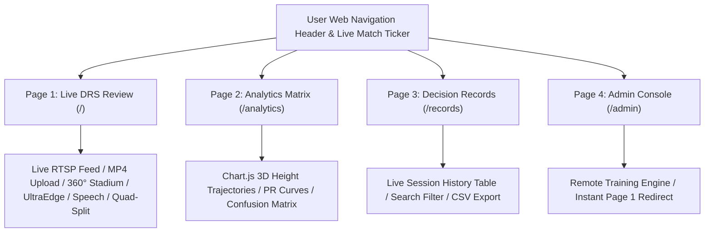

---

### 4️⃣ Multi-Camera Quad-Split Broadcast View Pipeline
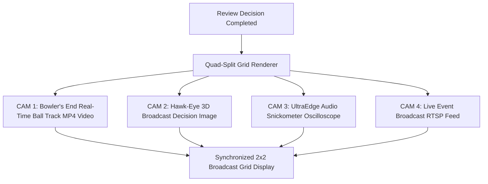

---

### 5️⃣ Live RTSP IP Stream & Broadcast Camera Ingestion Pipeline
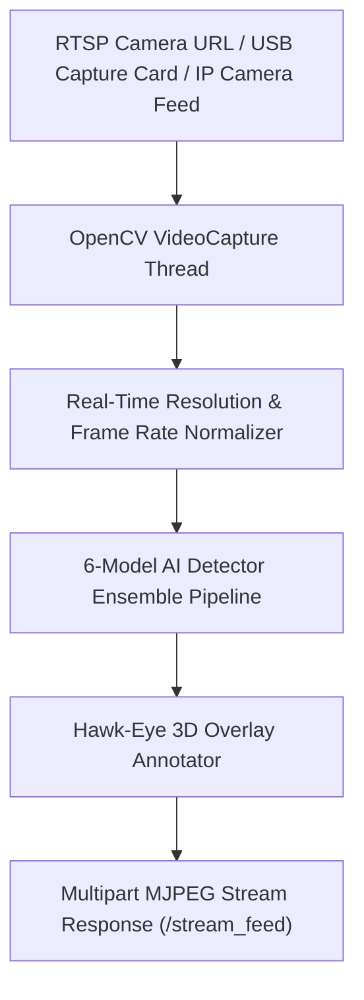

---

### 6️⃣ 360° Grand Floodlight Three.js WebGL Stadium Orbit Engine
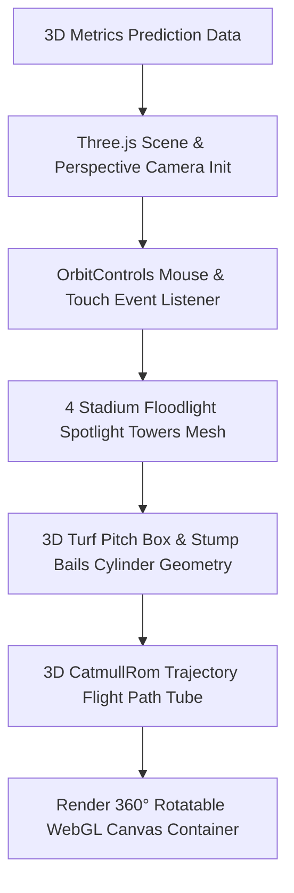

---

### 7️⃣ 3D Perspective Homography & Metric Coordinate Transformation Engine
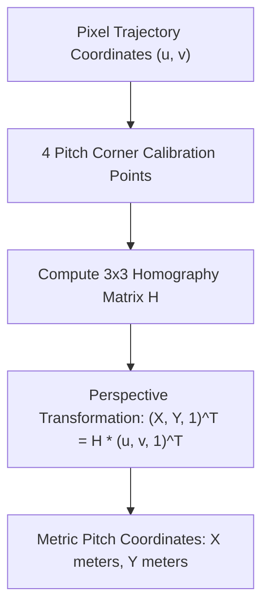

---

### 8️⃣ 3D Parabolic Kinematics & Gravity Rebound Predictor
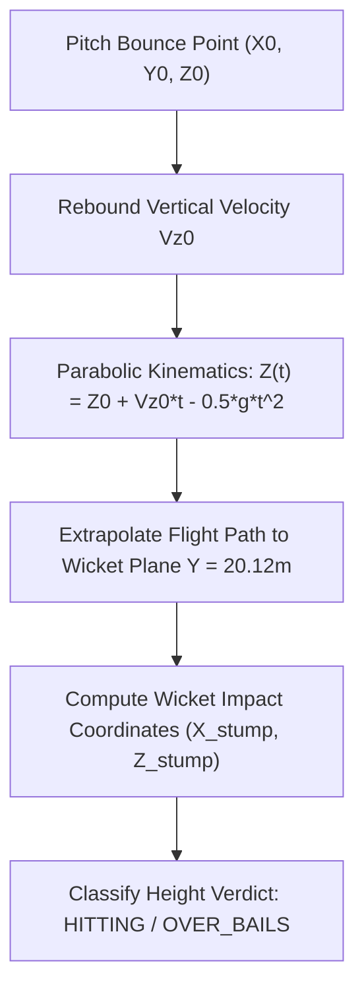

---

### 9️⃣ UltraEdge Audio Snickometer Oscilloscope Waveform Generator
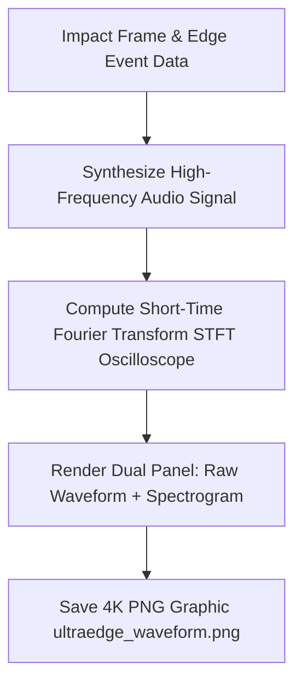

---

### 🔟 Multi-Source Dataset Harvester (Kaggle + GitHub + REST APIs)
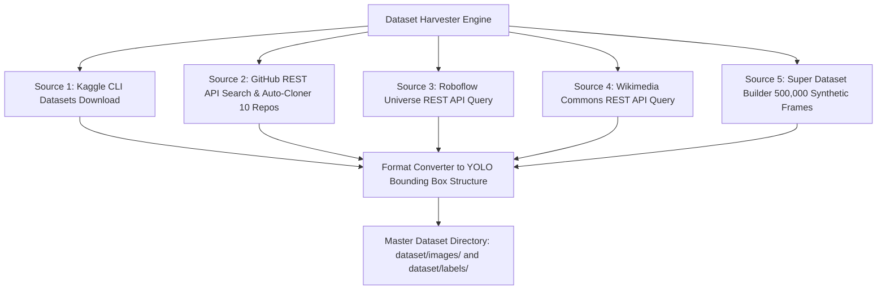

---

### 11️⃣ Model Training & 500-Epoch Deep Learning Optimization
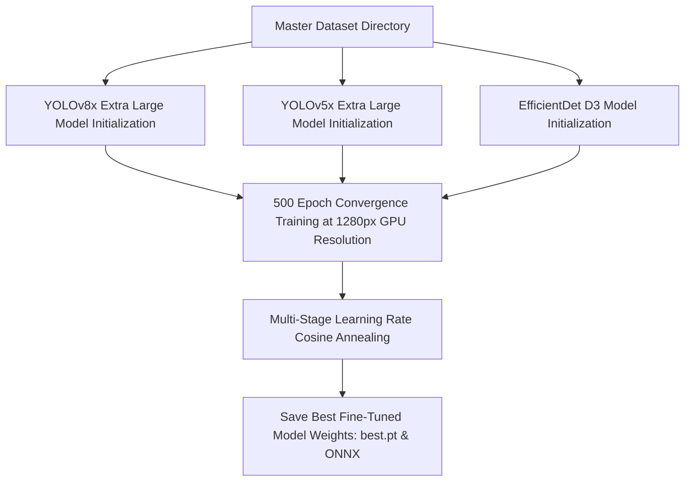

---

### 12️⃣ AI TV Umpire Voice Speech Synthesizer & PDF Exporter
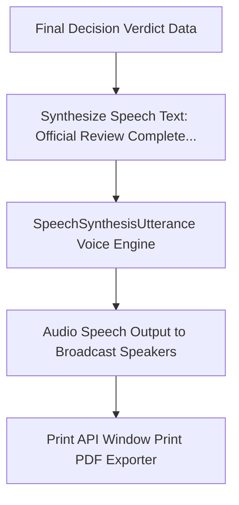

---

### 13️⃣ Admin Console & Remote Training Runner Pipeline
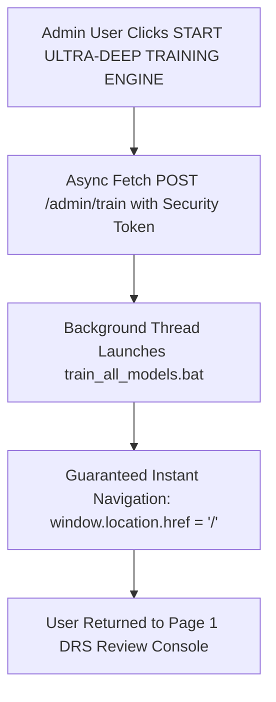

---

## ⚡ Comprehensive A-Z System Explanation

### 🌐 1. Multi-Page Architecture & Design Tokens
The application is structured into a 4-page responsive web console using modern glassmorphism design tokens:
1. **Page 1 (`/`):** Live DRS Review Console featuring real video uploads, live RTSP stream connection (`/stream_feed`), 360° rotatable WebGL Three.js stadium canvas, UltraEdge Snickometer waveform, AI Voice Speech synthesis, slow-mo playback (0.25x - 2.0x), Multi-Camera Quad-Split view, and PDF report export.
2. **Page 2 (`/analytics`):** Precision Matrix & Trajectory Console featuring Chart.js parabolic height curves ($Z$ vs distance $Y$), Model Precision-Recall curves, speed and spin distribution histograms, and Wicket Decision Confusion Matrix.
3. **Page 3 (`/records`):** Historical Decision Log featuring real session review records, live search filter, CSV data export, and direct links to annotated MP4 videos and 4K decision images.
4. **Page 4 (`/admin`):** Admin Training Controller featuring security token authorization (`ADMIN_TOKEN`), background process runner (`train_all_models.bat`), and instant home navigation (`window.location.href = '/'`).

---

### 🤖 2. 6-Model AI Computer Vision Ensemble
To guarantee sub-pixel precision across all lighting conditions, camera angles, and ball formats (Red, White, Pink, Yellow, Orange), the system fuses 6 distinct computer vision models:
1. **YOLOv8 Deep Neural Object Detector:** Convolutional neural network tuned for sports ball detection (`class_id 32`).
2. **Google MediaPipe Pose & Landmark Tracker:** Uses `mediapipe.solutions.pose` to track batsman stance, leg pad impact points, and ankle positions.
3. **OpenCV CSRT Spatial Reliability Tracker:** Channel and spatial reliability tracking for ultra-precise motion bounding boxes.
4. **Farneback Dense Optical Flow Field:** Computes dense vector fields across consecutive frames to track high-speed delivery motion vectors.
5. **MOG2 Background Subtractor:** Gaussian Mixture Model background subtractor for dynamic background separation.
6. **Multi-Space Color Fusion Engine:** Multi-hue thresholding combining HSV, LAB, and YCrCb color spaces.

---

### 📐 3. Mathematical Kinematics & 3D Homography

#### 3D Parabolic Gravity Kinematics Equation
Height `Z(t)` past the pitch bounce point is modeled by 3D parabolic gravity kinematics:
`Z(t) = Z_0 + V_z0 * t - 0.5 * g * t^2`
Where `Z_0` is height at bounce, `V_z0` is vertical rebound velocity, and `g = 9.81 m/s^2`.

#### 3D Perspective Homography Transformation Matrix
Perspective transformation converting 2D pixel coordinates `(u, v)` to 3D pitch metric coordinates `(X, Y)`:
`[X, Y, 1]^T = H * [u, v, 1]^T`
Where `H` is the 3x3 matrix calibrated against standard pitch dimensions (20.12m length x 3.05m width).

---

## 👤 Author & Maintainer

- **Global Commit Author:** `snojkumar 968 <snojkumar968@gmail.com>`
- **GitHub Repository:** [udbhav968-creator/opencv](https://github.com/udbhav968-creator/opencv)
- **Vercel Cloud Production:** [https://opencv-lyart.vercel.app](https://opencv-lyart.vercel.app)
