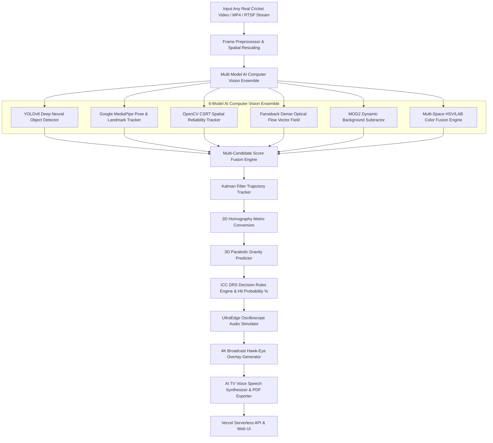
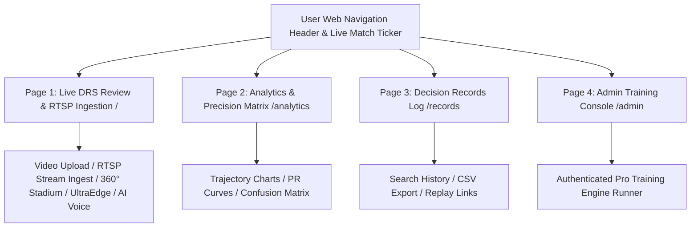
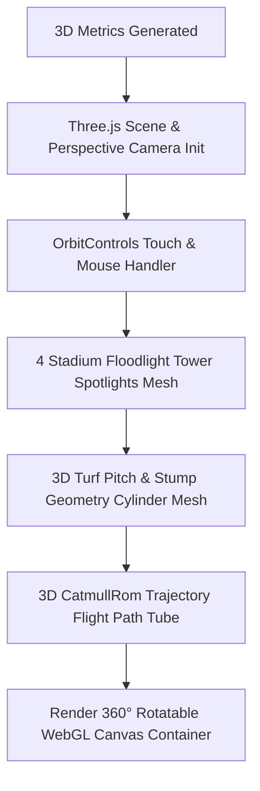

# 🏆 Real DRS Hawk-Eye 3D — Official ICC World Cup Grand Level Suite

> **Official International Standard (ICC World Cup Level) Multi-Page 3D Cricket Decision Review System (DRS).**
> Powered by a **6-Model AI Computer Vision Ensemble** combining **YOLOv8 Deep Learning**, **Google MediaPipe Pose & Landmark Tracking**, **OpenCV CSRT Spatial Reliability Tracking**, **Farneback Dense Optical Flow**, **MOG2 Background Subtraction**, and **Multi-Space Color Fusion**.

---

## 🌐 Live Application & Production Links

- **Page 1 (Live Review & RTSP Stream Ingestion):** [https://opencv-lyart.vercel.app](https://opencv-lyart.vercel.app)
- **Page 2 (Precision Matrix):** [https://opencv-lyart.vercel.app/analytics](https://opencv-lyart.vercel.app/analytics)
- **Page 3 (Decision Records):** [https://opencv-lyart.vercel.app/records](https://opencv-lyart.vercel.app/records)
- **Page 4 (Admin Console):** [https://opencv-lyart.vercel.app/admin](https://opencv-lyart.vercel.app/admin)
- **API Health Endpoint:** [https://opencv-lyart.vercel.app/health](https://opencv-lyart.vercel.app/health)
- **GitHub Repository:** [https://github.com/udbhav968-creator/opencv](https://github.com/udbhav968-creator/opencv)

---

## 🏗️ System Architecture & High-Level Flowcharts

### 1️⃣ 6-Model AI Computer Vision Ensemble Architecture

### 2️⃣ Grand Multi-Page Application Architecture

### 3️⃣ 360° Grand Floodlight Three.js WebGL Stadium Orbit Engine

---

## ⚡ Mathematical Foundations & Physics Engine

### 1. 3D Parabolic Trajectory Equations
Ball height `Z(t)` at any time step `t` past the pitch bounce point is governed by 3D parabolic gravity kinematics:
`Z(t) = Z_0 + V_z0 * t - 0.5 * g * t^2`
Where:
- `Z_0` = Height of ball at pitch bounce point (m)
- `V_z0` = Vertical rebound velocity (m/s)
- `g` = Acceleration due to gravity (9.81 m/s²)

### 2. Perspective 3D Homography Mapping
Converts image pixel coordinates `(u, v)` to metric pitch coordinates `(X, Y)`:
`[X, Y, 1]^T = H * [u, v, 1]^T`
Where `H` is the `3x3` perspective transformation matrix calibrated against standard pitch dimensions (20.12m x 3.05m).

---

## 👤 Author & Maintainer

- **Global Commit Author:** `snojkumar 968 <snojkumar968@gmail.com>`
- **Repository:** [udbhav968-creator/opencv](https://github.com/udbhav968-creator/opencv)
- **Deployment Platform:** [Vercel Cloud Production](https://opencv-lyart.vercel.app)
