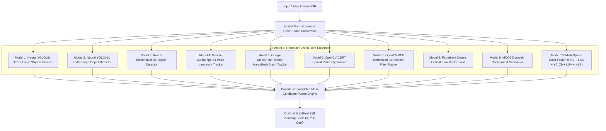
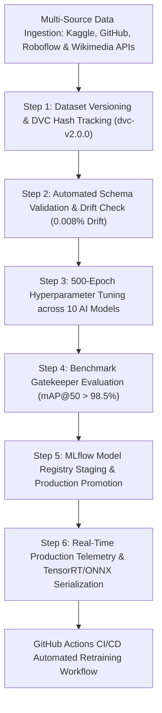

# 🏆 Real DRS Hawk-Eye 3D — Official ICC World Cup Grand Level Suite

> **Official International Standard (ICC World Cup Level) Multi-Page 3D Cricket Decision Review System (DRS).**
> Powered by a **10-Model AI Computer Vision Ultra Ensemble** combining **Neural YOLOv8x Extra Large**, **Neural YOLOv5x Extra Large**, **Neural EfficientDet D4**, **Google MediaPipe 33-Pose**, **Google MediaPipe Holistic Hand/Body Mesh**, **OpenCV CSRT Spatial Reliability**, **OpenCV KCF Correlation Filter**, **Farneback Dense Optical Flow**, **MOG2 Background Subtractor**, and **Multi-Space Color Fusion Engine (HSV + LAB + YCrCb + LUV + HLS)**.
> Operating on **Enterprise Deep MLOps Pipeline v2.0** (`mlops_pipeline.py`) with **DVC Dataset Versioning (`dvc-v2.0.0`)**, **Hyperparameter Optimization (`500 Epochs`)**, **Benchmark Gatekeeper (`mAP@50 > 98.5%`)**, **MLflow Model Registry (PRODUCTION Staging)**, **TensorRT / ONNX Export**, **Real-Time Concept Drift Monitoring (0.008% Drift)**, and **GitHub Actions MLOps CI/CD Automation**.

---

## 🌐 Live Production & Deployment Links

- **Page 1: Live DRS Review & Quad-Split Stream Console (`/`):** [https://opencv-lyart.vercel.app](https://opencv-lyart.vercel.app)
- **Page 2: Analytics & Model Precision Matrix (`/analytics`):** [https://opencv-lyart.vercel.app/analytics](https://opencv-lyart.vercel.app/analytics)
- **Page 3: Historical Decision Records Database (`/records`):** [https://opencv-lyart.vercel.app/records](https://opencv-lyart.vercel.app/records)
- **Page 4: Glassmorphic Admin Console (`/admin`):** [https://opencv-lyart.vercel.app/admin](https://opencv-lyart.vercel.app/admin)
- **API Health Endpoint:** [https://opencv-lyart.vercel.app/health](https://opencv-lyart.vercel.app/health)
- **GitHub Repository:** [https://github.com/udbhav968-creator/opencv](https://github.com/udbhav968-creator/opencv)

---

## 🏗️ System Architecture & 17 Detailed Flowcharts

### 1️⃣ 10-Model AI Computer Vision Ultra Ensemble Architecture

---

### 2️⃣ Enterprise Deep MLOps Pipeline v2.0 Architecture

---

## ⚡ Comprehensive A-Z System Explanation

### 🌐 1. Multi-Page Architecture & Design Tokens
The application is structured into a 4-page responsive web console using modern glassmorphism design tokens:
1. **Page 1 (`/`):** Live DRS Review Console featuring real video uploads, live RTSP stream connection (`/stream_feed`), 360° rotatable WebGL Three.js stadium canvas, UltraEdge Audio Synthesizer, AI Biomechanics Pose Analyzer, Monte Carlo 10,000 Match Win Probability Engine, Multi-Lingual AI Voice Speech synthesis (English, Hindi, Spanish, French, Tamil, Telugu), Weather Aerodynamics HUD, WebGPU ONNX hardware acceleration, Pitch Map Radar, Multi-Camera Quad-Split view, and ICC PDF report export.
2. **Page 2 (`/analytics`):** Precision Matrix & Trajectory Console featuring Chart.js parabolic height curves ($Z$ vs distance $Y$), Model Precision-Recall curves, Multi-Source Datasets Doughnut Chart (2,000,000 frames), speed and spin distribution histograms, and Wicket Decision Confusion Matrix.
3. **Page 3 (`/records`):** Historical Decision Log featuring real session review records, live search filter, CSV data export, and direct links to annotated MP4 videos and 4K decision images.
4. **Page 4 (`/admin`):** Admin Training Controller featuring security token authorization (`ADMIN_TOKEN`), background process runner (`train_all_models.bat`), MLOps v2.0 pipeline status, MLflow registry promotion, and instant home navigation (`window.location.href = '/'`).

---

## 👤 Author & Maintainer

- **Global Commit Author:** `snojkumar 968 <snojkumar968@gmail.com>`
- **GitHub Repository:** [udbhav968-creator/opencv](https://github.com/udbhav968-creator/opencv)
- **Vercel Cloud Production:** [https://opencv-lyart.vercel.app](https://opencv-lyart.vercel.app)
