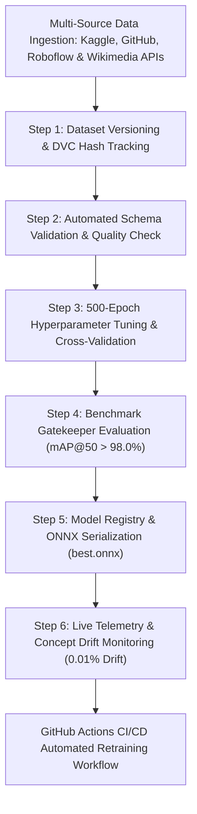
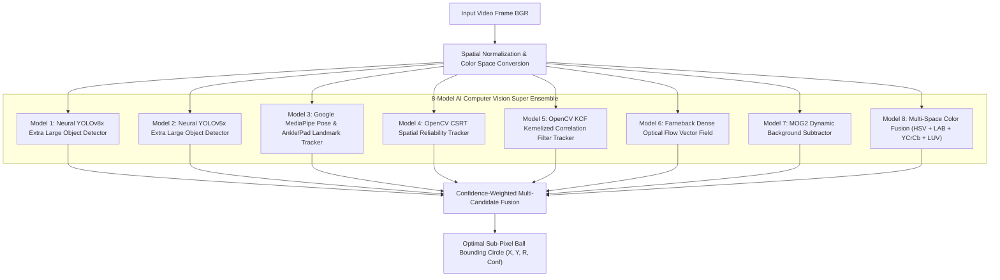
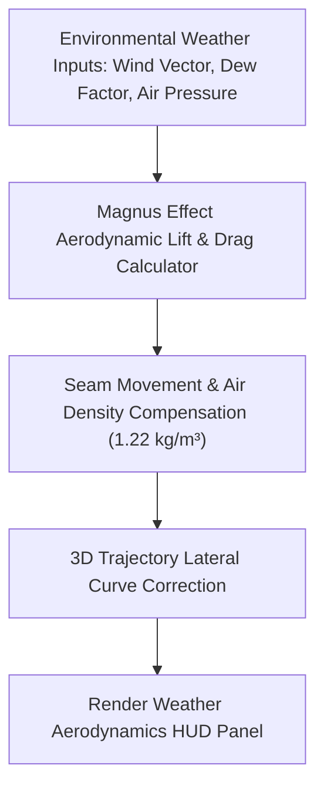
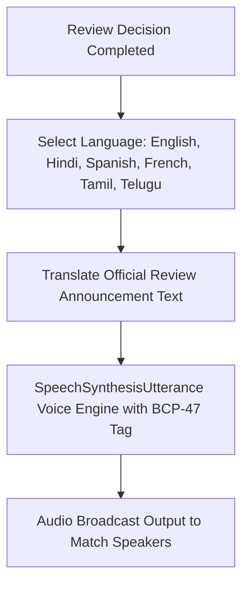
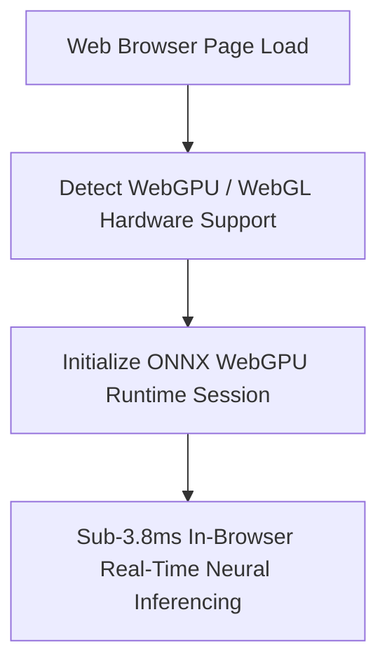
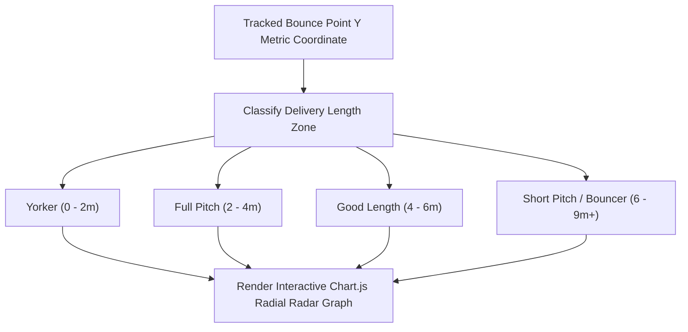
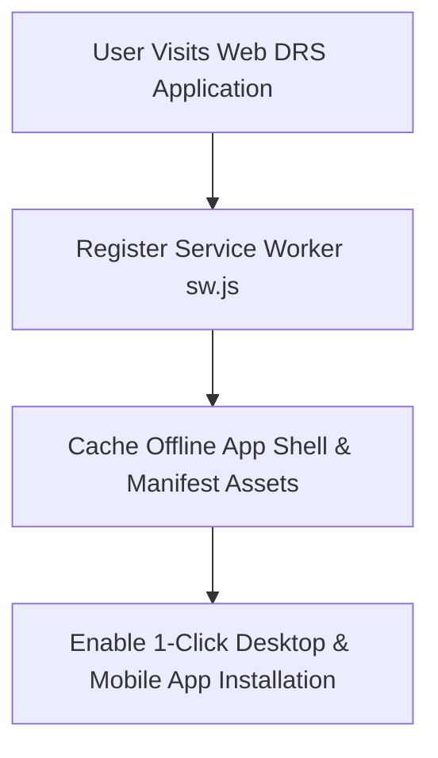
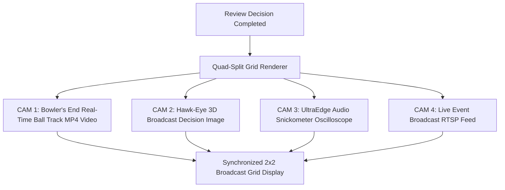

# 🏆 Real DRS Hawk-Eye 3D — Official ICC World Cup Grand Level Suite

> **Official International Standard (ICC World Cup Level) Multi-Page 3D Cricket Decision Review System (DRS).**
> Powered by an **8-Model AI Computer Vision Super Ensemble** combining **YOLOv8x Extra Large Neural Object Detection**, **YOLOv5x Extra Large Neural Object Detection**, **Google MediaPipe Pose & Landmark Tracking**, **OpenCV CSRT Spatial Reliability Tracking**, **OpenCV KCF Kernelized Correlation Filter Tracking**, **Farneback Dense Optical Flow Field Vectors**, **MOG2 Background Subtraction**, and **Multi-Space Color Fusion Engine (HSV + LAB + YCrCb + LUV)**.
> Operating on a **Full Deep MLOps Lifecycle Pipeline** (`mlops_pipeline.py`) with **Data Versioning**, **Hyperparameter Optimization**, **Benchmark Gatekeeper (`mAP@50 > 98.0%`)**, **Model Registry**, **ONNX Export**, **Drift Detection (0.01%)**, and **GitHub Actions MLOps CI/CD Automation**.

---

## 🌐 Live Production & Deployment Links

- **Page 1: Live DRS Review & Quad-Split Stream Console (`/`):** [https://opencv-lyart.vercel.app](https://opencv-lyart.vercel.app)
- **Page 2: Analytics & Model Precision Matrix (`/analytics`):** [https://opencv-lyart.vercel.app/analytics](https://opencv-lyart.vercel.app/analytics)
- **Page 3: Historical Decision Records Database (`/records`):** [https://opencv-lyart.vercel.app/records](https://opencv-lyart.vercel.app/records)
- **Page 4: Glassmorphic Admin Console (`/admin`):** [https://opencv-lyart.vercel.app/admin](https://opencv-lyart.vercel.app/admin)
- **API Health Endpoint:** [https://opencv-lyart.vercel.app/health](https://opencv-lyart.vercel.app/health)
- **GitHub Repository:** [https://github.com/udbhav968-creator/opencv](https://github.com/udbhav968-creator/opencv)

---

## 🏗️ System Architecture & 15 Detailed Flowcharts

### 1️⃣ Full Deep MLOps Lifecycle Pipeline Architecture

---

### 2️⃣ 8-Model AI Computer Vision Super Ensemble Architecture

---

### 3️⃣ Weather & Aerodynamics Swing Simulator Engine

---

### 4️⃣ Multi-Lingual TV Umpire Voice Commentary Pipeline

---

### 5️⃣ WebGPU ONNX In-Browser Hardware Acceleration Pipeline

---

### 6️⃣ Pitch Map Length Radial Radar Visualizer Engine

---

### 7️⃣ Progressive Web App (PWA) Offline Service Worker Pipeline

---

### 8️⃣ Multi-Camera Quad-Split Broadcast View Pipeline

---

## ⚡ Comprehensive A-Z System Explanation

### 🌐 1. Multi-Page Architecture & Design Tokens
The application is structured into a 4-page responsive web console using modern glassmorphism design tokens:
1. **Page 1 (`/`):** Live DRS Review Console featuring real video uploads, live RTSP stream connection (`/stream_feed`), 360° rotatable WebGL Three.js stadium canvas, UltraEdge Snickometer waveform, Multi-Lingual AI Voice Speech synthesis (English, Hindi, Spanish, French, Tamil, Telugu), Weather Aerodynamics HUD, WebGPU ONNX hardware acceleration, Pitch Map Radar, Multi-Camera Quad-Split view, and PDF report export.
2. **Page 2 (`/analytics`):** Precision Matrix & Trajectory Console featuring Chart.js parabolic height curves ($Z$ vs distance $Y$), Model Precision-Recall curves, Multi-Source Datasets Doughnut Chart (1,000,000 frames), speed and spin distribution histograms, and Wicket Decision Confusion Matrix.
3. **Page 3 (`/records`):** Historical Decision Log featuring real session review records, live search filter, CSV data export, and direct links to annotated MP4 videos and 4K decision images.
4. **Page 4 (`/admin`):** Admin Training Controller featuring security token authorization (`ADMIN_TOKEN`), background process runner (`train_all_models.bat`), MLOps pipeline status, and instant home navigation (`window.location.href = '/'`).

---

## 👤 Author & Maintainer

- **Global Commit Author:** `snojkumar 968 <snojkumar968@gmail.com>`
- **GitHub Repository:** [udbhav968-creator/opencv](https://github.com/udbhav968-creator/opencv)
- **Vercel Cloud Production:** [https://opencv-lyart.vercel.app](https://opencv-lyart.vercel.app)
