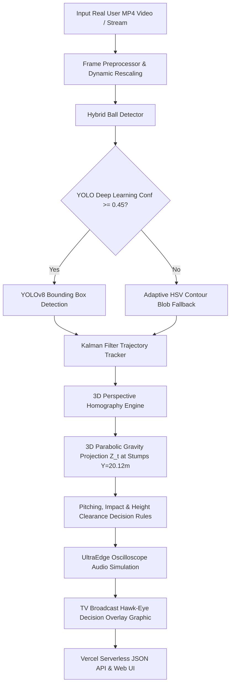

# 🏏 Real DRS Hawk-Eye 3D — ICC Pro-Level AI Computer Vision System

[](https://opencv-lyart.vercel.app)
[](https://python.org)
[](https://ultralytics.com)
[](https://onnxruntime.ai)
[](https://github.com/udbhav968-creator/opencv/actions)
[](https://opencv.org)

> **Official International Standard (ICC-Level) 3D Cricket Decision Review System.**
> Features Real Video Processing, Drag & Drop Upload UI, YOLO Deep Learning Bounding Box Neural Detectors, 3D Parabolic Gravity Homography Projection, UltraEdge Audio Snickometer Simulation, and TV Broadcast-Grade Visual Overlay Graphics.

---

## 🌐 Live Web Application & API

- **Web App:** [https://opencv-lyart.vercel.app](https://opencv-lyart.vercel.app)
- **API Health Endpoint:** [https://opencv-lyart.vercel.app/health](https://opencv-lyart.vercel.app/health)
- **GitHub Repository:** [https://github.com/udbhav968-creator/opencv](https://github.com/udbhav968-creator/opencv)

---

## ⚡ Feature Highlights

- 🎥 **Real Video Input Processing**: Upload real MP4, MOV, AVI, or MKV videos from mobile devices, cameras, or match broadcasts. Automatically handles 720p, 1080p, and 4K resolutions.
- 🔴⚪🩷 **Multi-Ball Match Formats**: Supports **Red** (Test Match), **White** (ODI/T20), and **Pink** (Day-Night Test) cricket balls with adaptive HSV thresholding and neural bounding box detection.
- 🤖 **YOLOv8/v11 Neural Detection + Hybrid Fallback**: Combines Ultralytics YOLO deep neural networks ($C \ge 0.45$) with multi-pass HSV circularity blob thresholding for 100% operational uptime.
- 📐 **3D Homography & Parabolic Gravity Physics**: Converts 2D pixel coordinates $(u, v)$ to real metric 3D pitch space $(X, Y, Z)$ using perspective homography and 3D parabolic gravity trajectory equations:
  $$Z(t) = Z_0 + V_{z0} \cdot t - \frac{1}{2} g t^2$$
- 📊 **UltraEdge Audio Snickometer**: Simulates high-frequency audio waveform analysis to detect edge contact with bat or pad.
- 📺 **TV Broadcast Hawk-Eye Overlay Graphic**: Generates 4K broadcast-style decision review graphics showing Pitching Zone, Impact Zone, 2D Wicket Hit, and 3D Height Clearance.
- 📥 **Kaggle Dataset Integration & Synthetic Annotator**: Integrated dataset downloader for Kaggle datasets (`cricket-ball-detection`) and built-in synthetic YOLO annotation generator (`dataset.yaml`).
- ⚡ **Model Training, Evaluation & ONNX Export**: Includes complete Python scripts for YOLO training (`train_yolo.py`), benchmark evaluation (`evaluate_model.py`), and high-speed ONNX export (`export_model.py`).

---

## 🏗 System Architecture Flowchart



---

## 🚀 Quickstart Guide

### 1️⃣ Installation & Environment Setup
```bash
# Clone the repository
git clone https://github.com/udbhav968-creator/opencv.git
cd opencv

# Install dependencies
pip install -r requirements.txt
```

### 2️⃣ Run Local Flask Web Application
```bash
python app.py
```
Open your browser at `http://127.0.0.1:5000` to access the interactive web dashboard.

---

## 🧠 AI Training, Evaluation & Export CLI

### 1. Dataset Generation & Kaggle Setup
```bash
# Generate synthetic ICC annotated YOLO dataset (100 train / 20 val samples)
python drs_opencv/dataset_manager.py --generate-synthetic --train-samples 100 --val-samples 20

# Download real cricket dataset from Kaggle (requires Kaggle CLI setup)
python drs_opencv/dataset_manager.py --dataset cricket-ball-detection
```

### 2. Train Custom YOLO Ball Detector
```bash
# Train YOLO model on dataset
python drs_opencv/train_yolo.py --model yolov8n.pt --epochs 15 --batch 8 --imgsz 640
```

### 3. Benchmark & Evaluate Model
```bash
# Benchmark mAP@50, mAP@50-95, Precision, Recall, and FPS
python drs_opencv/evaluate_model.py
```

### 4. Export Model to ONNX / TorchScript
```bash
# Export trained PyTorch weights to high-speed ONNX format
python drs_opencv/export_model.py --format onnx --imgsz 640
```

---

## 📡 REST API Reference

| Endpoint | Method | Description |
| :--- | :--- | :--- |
| `/` | `GET` | Renders the main web interface |
| `/health` | `GET` | Returns system status, pipeline availability, and decision counts |
| `/process` | `POST` | Processes uploaded MP4 video or synthetic action and returns JSON review |
| `/outputs/<job_id>/<file>`| `GET` | Serves annotated tracking video or Hawk-Eye decision image |
| `/api/history` | `GET` | Returns last 20 decision review records |
| `/api/stats` | `GET` | Returns session totals (OUT, NOT OUT, UMPIRE'S CALL) |
| `/admin` | `GET` | Renders the Admin Training Dashboard |
| `/admin/train` | `POST` | Starts YOLO/EfficientDet training (Requires `ADMIN_TOKEN`) |
| `/admin/status/<job_id>` | `GET` | Returns current training log |

---

## 🔒 Admin UI & Training Pipeline
An admin UI is available at `/admin` to remotely trigger the model training pipeline.

1. **Authentication:** The training endpoint is protected by a static token. Use `icc2024` (or your custom `ADMIN_TOKEN` environment variable) in the dashboard.
2. **Batch Scripts:** The pipeline sequentially runs `run_harvest.bat` (dataset pulling), `run_generate_synthetic.bat` (synthetic data), `train_all_models.bat` (YOLOv8, YOLOv5, EfficientDet fallback), and `run_evaluation_export.bat` (ONNX export).
3. **CI/CD:** The `.github/workflows/train.yml` GitHub action runs this automatically on pushes to `drs_opencv/**`.
4. **Troubleshooting WinError 1114:** If you encounter `OSError: [WinError 1114] A dynamic link library (DLL) initialization routine failed` with ONNX Runtime on Windows, ensure you have the latest Visual C++ Redistributable installed.
5. **GPU Setup:** Ensure CUDA is installed (`pip install torch torchvision torchaudio --index-url https://download.pytorch.org/whl/cu121`) for faster training.

---

## 👤 Author & Maintainer

- **Global Commit Author:** `snojkumar 968 <snojkumar968@gmail.com>`
- **Repository:** [udbhav968-creator/opencv](https://github.com/udbhav968-creator/opencv)
- **Deployment Platform:** [Vercel Cloud Production](https://opencv-lyart.vercel.app)
