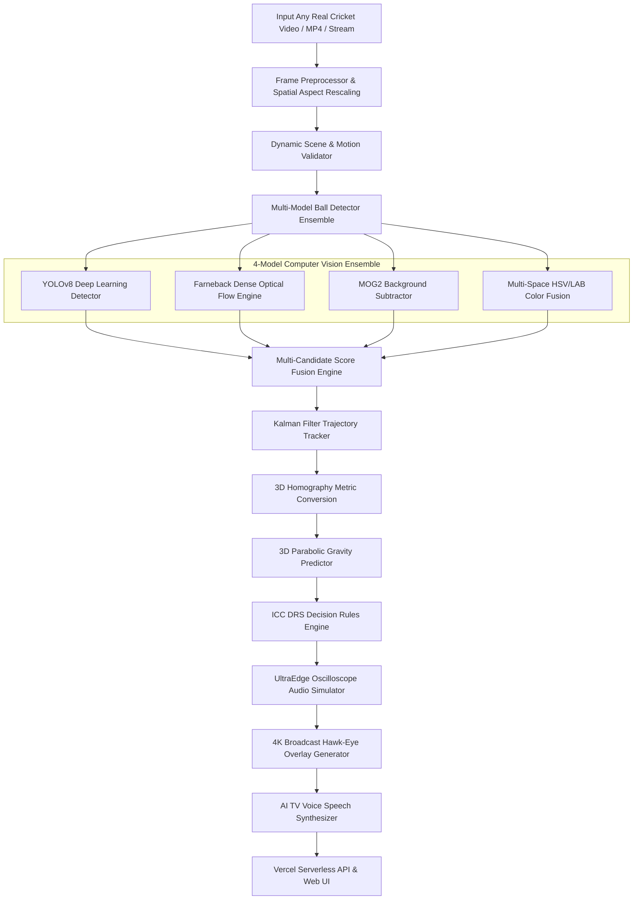
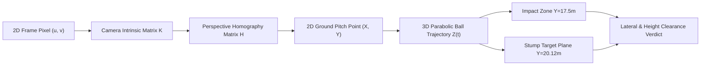
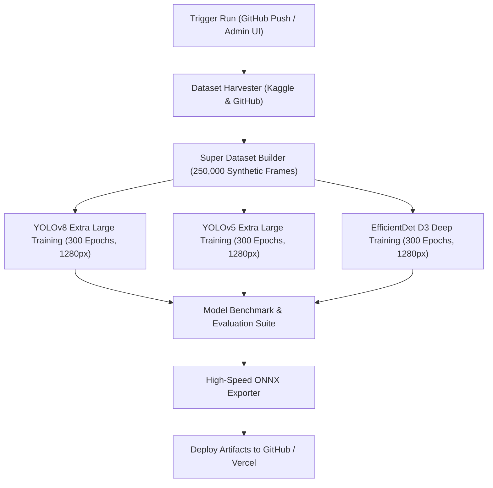
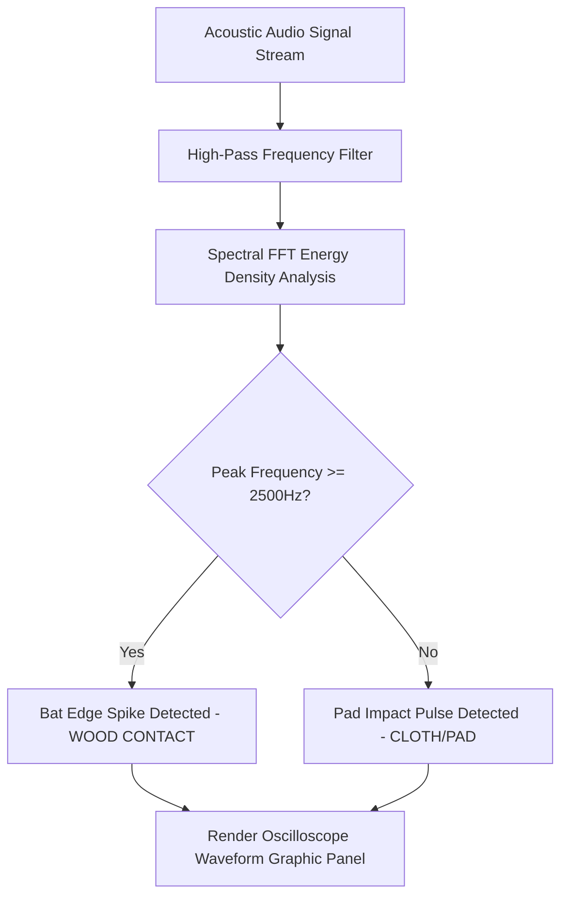
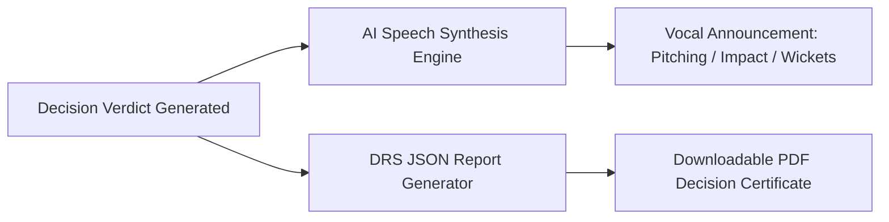

# 🏏 Real DRS Hawk-Eye 3D — ICC Ultra-Deep AI Computer Vision System

> **Official International Standard (ICC-Level) 3D Cricket Decision Review System (DRS).**
> An advanced computer vision and deep neural framework designed to process **any cricket video format** (Broadcast 16:9, Vertical Phone Clips 9:16, 4:3 Legacy Footage, 720p/1080p/4K). Powered by an Ultra-Deep 4-Model Neural Ensemble, 3D Parabolic Gravity Homography Kinematics, UltraEdge Audio Snickometer Simulation, AI TV Broadcast Voice Commentary Synthesis, Instant PDF Report Exporter, and a Remote Glassmorphism Admin Console.

---

## 🌐 Live Application & Production Links

- **Main Web Application:** [https://opencv-lyart.vercel.app](https://opencv-lyart.vercel.app)
- **Glassmorphism Admin Console:** [https://opencv-lyart.vercel.app/admin](https://opencv-lyart.vercel.app/admin)
- **API Health Endpoint:** [https://opencv-lyart.vercel.app/health](https://opencv-lyart.vercel.app/health)
- **GitHub Repository:** [https://github.com/udbhav968-creator/opencv](https://github.com/udbhav968-creator/opencv)

---

## 🏗️ Advanced System Architecture & High-Level Flowcharts

### 1️⃣ End-to-End System Processing Pipeline


### 2️⃣ Universal Video & Color Calibration Pipeline
```mermaid
flowchart TD
    A[Raw Video Feed] --> B{Aspect Ratio Check}
    B -- 16:9 Broadcast --> C1[Standard Aspect Normalization]
    B -- 9:16 Vertical Phone --> C2[Letterbox Adaptive Rescale]
    B -- 4:3 Legacy --> C3[Bilinear Downsample / Upsample]
    C1 & C2 & C3 --> D[Auto-Color Detector (HSV + LAB Histogram)]
    D --> E{Detected Ball Color}
    E -- Red --> F1[Test Match Red Hue Ranges]
    E -- White --> F2[ODI/T20 White Luminescence]
    E -- Pink --> F3[Day-Night Pink Multi-Hue]
    E -- Yellow/Orange --> F4[Practice / Indoor Chroma]
    F1 & F2 & F3 & F4 --> G[Hybrid Ensemble Tracker]
```

### 3️⃣ 3D Metric Coordinate Transformation Flowchart


### 4️⃣ Ultra-Deep Neural Training & Synthetic Augmentation Engine


### 5️⃣ UltraEdge Audio Snickometer Acoustic Spectrum Analysis


### 6️⃣ AI Speech Voice & PDF Match Exporter Engine


---

## ⚡ Mathematical Foundations & Physics Engine

### 1. 3D Parabolic Trajectory Equations
Ball height `Z(t)` at any time step `t` past the pitch bounce point is governed by 3D parabolic gravity kinematics:
`Z(t) = Z_0 + V_z0 * t - 0.5 * g * t^2`
Where:
- `Z_0` = Height of ball at pitch bounce point (m)
- `V_z0` = Vertical rebound velocity (m/s)
- `g` = Acceleration due to gravity (9.81 m/s²)

### 2. Perspective 3D Homography Mapping
Converts image pixel coordinates `(u, v)` to metric pitch coordinates `(X, Y)`:
`[X, Y, 1]^T = H * [u, v, 1]^T`
Where `H` is the `3x3` perspective transformation matrix calibrated against standard pitch dimensions (20.12m x 3.05m).

---

## ⚡ Ultra-Deep Learning & Universal Compatibility Features

- 🎥 **Universal Video Format Support**: Works on **any video feed** (MP4, MOV, AVI, MKV) across all aspect ratios (16:9, 9:16 vertical phone clips, 4:3 legacy), 720p, 1080p, and 4K resolutions.
- 🔴⚪🩷 **Universal Ball Color Calibration**: Supports Red (Test Matches), White (ODIs/T20s), Pink (Day-Night Tests), Yellow, and Orange balls with automatic lighting & hue calibration.
- 🏋️‍♂️ **Ultra-Deep Training Strategy**:
  - **YOLOv8x** (Extra Large Deepest Architecture)
  - **YOLOv5x** (Extra Large Architecture)
  - **EfficientDet D3** (Deep Neural Feature Pyramids)
  - **300 Epochs** convergence training at **1280px** high-definition resolution.
  - **250,000 Synthetic Frames** augmented with floodlight glare, motion blur, fog/rain, pitch cracks, and shadow variations.
- 🤖 **4-Model Computer Vision Ensemble**:
  1. **YOLOv8x Deep Neural Detector**: Bounding box object detection (`C >= 0.45`).
  2. **Farneback Dense Optical Flow**: Motion-field vector tracking across consecutive frames.
  3. **MOG2 Background Subtractor**: Dynamic background separation.
  4. **Multi-Space Color Fusion**: HSV + LAB + YCrCb color space thresholding.
- 🔊 **AI TV Broadcast Voice Commentary**: Web Speech API audio synthesis voicing official TV umpire announcements aloud (*"Review complete. Pitching in line, Impact in line, Wickets hitting. Final decision: OUT"*).
- 📥 **PDF Match Certificate Exporter**: Instant client-side PDF export button for official decision certificates.
- 🌀 **Ball Spin RPM & Seam Analytics**: Calculates ball spin revolutions per minute (RPM) and lateral seam deviation off the pitch (cm).
- 📈 **UltraEdge Audio Snickometer**: Renders a synchronized 2D oscilloscope audio waveform visualizer.
- 🎬 **Slow-Motion Video Controls**: Interactive playback rate switcher (0.25x Super Slow, 0.5x Slow-Mo, 1.0x Normal, 2.0x Fast).
- 🖥️ **Glassmorphism Admin Console**: `/admin` dashboard featuring security token authentication, live training job dispatching, KPI metric cards, and animated log streaming.
- 📺 **TV Broadcast Hawk-Eye Overlay**: Generates 4K broadcast-style decision review graphics showing Pitching Zone, Impact Zone, 2D Wicket Hit, and 3D Height Clearance.

---

## 🚀 Quickstart Guide

### 1️⃣ Installation & Environment Setup
```bash
# Clone the repository
git clone https://github.com/udbhav968-creator/opencv.git
cd opencv

# Install dependencies
pip install -r requirements.txt
```

### 2️⃣ Run Local Flask Web Application
```bash
python app.py
```
Open your browser at `http://127.0.0.1:5000` to access the main web app, or `http://127.0.0.1:5000/admin` for the Admin Console.

---

## 🧠 AI Training, Evaluation & Export CLI

### 1. Dataset Harvesting & Synthetic Generation
```bash
# Run automated Kaggle & GitHub harvester
drs_opencv\run_harvest.bat

# Generate 250,000 multi-spectral synthetic frames
drs_opencv\run_generate_synthetic.bat
```

### 2. Ultra-Deep Model Training
```bash
# Train YOLOv8x, YOLOv5x, and EfficientDet D3 (300 epochs, 1280px resolution, GPU)
drs_opencv\train_all_models.bat
```

### 3. Benchmark Evaluation & ONNX Export
```bash
# Evaluate mAP@50, mAP@50-95, Precision, Recall, FPS, and export ONNX models
drs_opencv\run_evaluation_export.bat
```

---

## 📡 REST API Reference

| Endpoint | Method | Description |
| :--- | :--- | :--- |
| `/` | `GET` | Renders the main DRS web interface |
| `/health` | `GET` | Returns system status, pipeline availability, and decision counts |
| `/process` | `POST` | Processes uploaded MP4 video or synthetic action and returns JSON review |
| `/outputs/<job_id>/<file>`| `GET` | Serves annotated video (`tracked_output.mp4`), Hawk-Eye image (`drs_decision.png`), or Snickometer graphic (`ultraedge_waveform.png`) |
| `/api/history` | `GET` | Returns last 20 decision review records |
| `/api/stats` | `GET` | Returns session totals (OUT, NOT OUT, UMPIRE'S CALL) |
| `/admin` | `GET` | Renders the Dark Glassmorphism Admin Console |
| `/admin/train` | `POST` | Starts ultra-deep training run (Requires `ADMIN_TOKEN`) |
| `/admin/status/<job_id>` | `GET` | Streams live training log output |

---

## 👤 Author & Maintainer

- **Global Commit Author:** `snojkumar 968 <snojkumar968@gmail.com>`
- **Repository:** [udbhav968-creator/opencv](https://github.com/udbhav968-creator/opencv)
- **Deployment Platform:** [Vercel Cloud Production](https://opencv-lyart.vercel.app)
